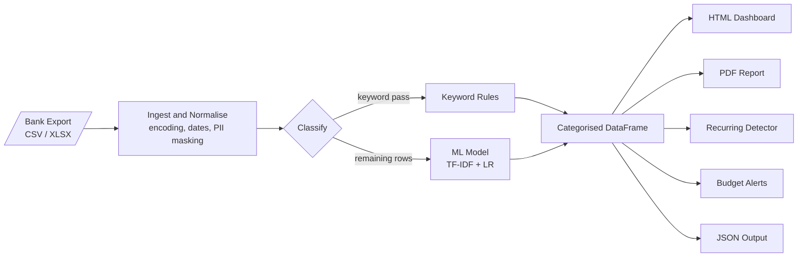

# SpendWise AI

> **Your finances, analysed locally.**
> Drop a bank export in. Get categorised spending, ML-powered insights, and an interactive dashboard — in under a minute. No cloud. No API keys. No data leaves your machine.

[](#) [](#) [](#) [](#)

---

## What it does

| Feature | Detail |
|---------|--------|
| **Auto-categorises transactions** | Keyword rules with an ML fallback (TF-IDF + logistic regression) that learns from your history |
| **Detects recurring charges** | Subscriptions and regular payments flagged without any configuration |
| **Budget tracking & alerts** | Set monthly limits per category; get warned at 80 % and 100 % |
| **Interactive HTML dashboard** | 7 charts — donut, trend, top merchants, income vs expenses, and more — fully offline |
| **PDF report** | Multi-page export for archiving or sharing |
| **Pipe-friendly JSON mode** | `--json --no-feedback` for scripting and automation |

---

## Pipeline



---

## Quick Start

```bash
# 1. Install
pip install -r requirements.txt

# 2. Drop your bank export into data/raw/, then run
python main.py --file data/raw/export.csv --dashboard
```

Your dashboard is saved to `exports/dashboard_YYYY-MM-DD_to_YYYY-MM-DD.html` — open it in any browser, no server needed.

**Supported formats:** `.csv`, `.xlsx`, `.xls`
**Required columns:** `Date`, `Description`, `Amount` (or you'll be prompted to map them)

---

## Common Commands

```bash
# Interactive review + PDF report
python main.py --file data/raw/export.csv --dashboard --pdf

# Automation / pipe mode — JSON to stdout, no prompts
python main.py --file data/raw/export.csv --json --no-feedback

# Set monthly budget limits, then run with dashboard
python main.py --file data/raw/export.csv --set-budget "Groceries:400" "Transport:100" --dashboard

# Retrain the ML classifier from your entire labelled history
python main.py --file data/raw/export.csv --retrain-ml
```

---

## CLI Reference

| Flag | Description |
|------|-------------|
| `--file PATH` | **(required)** Path to raw bank export |
| `--dashboard` | Generate interactive HTML dashboard |
| `--pdf` | Generate multi-page PDF report |
| `--json` | Write JSON summary to stdout |
| `--output-json PATH` | Write JSON summary to a file |
| `--no-feedback` | Skip interactive review (for scripting) |
| `--retrain-ml` | Retrain ML classifier after this run |
| `--set-budget CAT:AMT` | Set one or more monthly budget limits |
| `--keywords PATH` | Custom `keywords.json` path |
| `--budgets PATH` | Custom `budgets.json` path |
| `--exports-dir DIR` | Output directory for dashboards and PDFs |

---

## Customising Categories

Edit `config/keywords.json` to add merchants or new categories:

```json
{
  "Pet Care":    ["petco", "petsmart", "chewy"],
  "Food & Drink": ["starbucks", "chipotle", "your local cafe"]
}
```

Keywords are **case-insensitive substring matches** — `"starbucks"` matches `"STARBUCKS #1234"`.
After adding new categories, run `--retrain-ml` so the ML model picks them up.

---

## Privacy

- **100 % local** — no network calls after install.
- Card numbers (12–16 digits) are auto-masked to `****1234` in every output — terminal, CSV, and dashboard.
- No analytics, telemetry, or logging to external services.

---

## Dependencies

| Package | Purpose |
|---------|---------|
| `pandas ≥ 2.0` | Data processing |
| `plotly ≥ 5.18` | Interactive charts |
| `scikit-learn ≥ 1.2` | ML classifier |
| `openpyxl ≥ 3.1` | Excel file support |
| `chardet ≥ 5.2` | Encoding detection |
| `kaleido ≥ 0.2.1` | Static PNG rendering (PDF charts) |
| `reportlab ≥ 4.0` | PDF assembly |

---

## Project Structure

```
spendwise-ai/
├── main.py                    # CLI entry point
├── data/raw/                  # Drop raw bank exports here
├── data/processed/            # Cleaned, categorised CSVs (auto-generated)
├── exports/                   # Dashboards and PDF reports (auto-generated)
├── scripts/
│   ├── ingest.py              # Ingestion & normalisation
│   ├── classifier.py          # Keyword categoriser
│   ├── ml_classifier.py       # ML classifier (TF-IDF + logistic regression)
│   ├── recurring.py           # Recurring transaction detector
│   ├── budget.py              # Budget targets & alerts
│   ├── dashboard.py           # Plotly HTML + PDF dashboard
│   └── terminal_output.py     # Terminal & JSON summary
├── config/
│   ├── keywords.json          # Category → keyword mapping (edit this)
│   ├── budgets.json           # Category → monthly limit (edit this)
│   └── ml_config.json         # ML settings (confidence threshold)
└── models/                    # Trained ML model (git-ignored, auto-generated)
```
