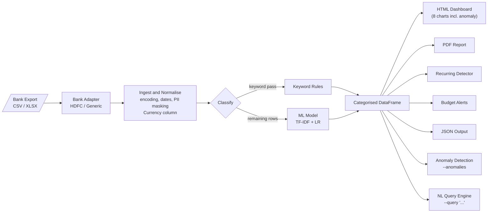

# SpendWise AI

> **Your finances, analysed locally.**
> Drop a bank export in. Get categorised spending, ML-powered insights, and an interactive dashboard — in under a minute. No cloud. No API keys. No data leaves your machine.

[](#) [](#) [](#) [](#)

---

## What it does

| Feature | Detail |
|---------|--------|
| **Multi-bank adapter support** | Auto-detects HDFC Bank exports; generic fallback handles any standard CSV with fuzzy column mapping |
| **Multi-currency tracking** | `Currency` column preserved per transaction (INR, GBP, USD, etc.); per-currency breakdown in summary and dashboard |
| **Auto-categorises transactions** | Keyword rules with an ML fallback (TF-IDF + logistic regression) that learns from your history |
| **Detects recurring charges** | Subscriptions and regular payments flagged without any configuration |
| **Budget tracking & alerts** | Set monthly limits per category; get warned at 80 % and 100 % |
| **Anomaly detection** | Flags unusual transactions via modified z-score (median + MAD); per-category with global fallback for singletons |
| **Natural language queries** | Ask questions in plain English: `show groceries`, `top 5 last 3 months`, `sum food & drink`. Agent mode (Ollama) handles open-ended questions beyond the fixed patterns |
| **Interactive HTML dashboard** | 8 charts — donut, trend, top merchants, income vs expenses, anomaly scatter, and more — fully offline |
| **Web UI** | Browser-based interface via `app.py` — upload a file, view results, run NL queries, and open the dashboard without touching the terminal |
| **PDF report** | Multi-page export for archiving or sharing |
| **Pipe-friendly JSON mode** | `--json --no-feedback` for scripting and automation |

---

## Pipeline



---

## Quick Start

```bash
# 1. Install
pip install -r requirements.txt

# 2. Drop your bank export into data/raw/, then run
python main.py --file data/raw/export.csv --dashboard
```

Your dashboard is saved to `exports/dashboard_YYYY-MM-DD_to_YYYY-MM-DD.html` — open it in any browser, no server needed.

### Web UI (optional)

A local browser interface is available if you prefer not to use the terminal:

```bash
pip install fastapi uvicorn python-multipart
python app.py
# Open http://localhost:8000
```

Upload any CSV or XLSX directly from the browser. Results, NL queries, and the full Plotly dashboard are all accessible from the same page. All processing stays local — `app.py` is just a thin wrapper around the same pipeline as `main.py`.

**Supported formats:** `.csv`, `.xlsx`, `.xls`
**Required columns:** `Date`, `Description`, `Amount` (or you'll be prompted to map them)

### Agent-based NL Queries (optional)

By default `--query` uses a regex engine that handles a fixed set of patterns. Install [Ollama](https://ollama.com) to unlock open-ended questions powered by a local LLM:

```bash
# 1. Install Ollama — https://ollama.com (one-time, separate from pip)

# 2. Pull a tool-calling model (~4.7 GB, one-time)
ollama pull llama3.1:8b

# 3. Install the Python client
pip install ollama

# 4. Run — the agent activates automatically when Ollama is available
python main.py --file data/raw/export.csv --query "which category am I overspending on vs last month?"
```

**Fallback:** if Ollama is not running or the model is not pulled, `--query` silently falls back to the regex engine. No configuration needed.

**Compatible models** (must support tool/function calling): `llama3.1:8b` (default), `qwen2.5:7b`, `mistral:7b`

---

## Common Commands

```bash
# Interactive review + PDF report
python main.py --file data/raw/export.csv --dashboard --pdf

# Automation / pipe mode — JSON to stdout, no prompts
python main.py --file data/raw/export.csv --json --no-feedback

# HDFC Bank statement (auto-detected, or force with --bank hdfc)
python main.py --file data/raw/hdfc_statement.csv --dashboard

# Non-USD import — set the currency code for the generic adapter
python main.py --file data/raw/barclays.csv --currency GBP --dashboard

# Set monthly budget limits, then run with dashboard
python main.py --file data/raw/export.csv --set-budget "Groceries:400" "Transport:100" --dashboard

# Retrain the ML classifier from your entire labelled history
python main.py --file data/raw/export.csv --retrain-ml

# Detect unusual transactions (modified z-score per category)
python main.py --file data/raw/export.csv --anomalies

# Ask a natural language question about your spending
python main.py --file data/raw/export.csv --query "show groceries"
python main.py --file data/raw/export.csv --query "top 5 last 3 months"
python main.py --file data/raw/export.csv --query "categories"

# With Ollama running, open-ended questions work too
python main.py --file data/raw/export.csv --query "which category am I overspending on vs last month?"
python main.py --file data/raw/export.csv --query "did I spend more on food or transport in February?"
```

---

## CLI Reference

| Flag | Description |
|------|-------------|
| `--file PATH` | **(required)** Path to raw bank export |
| `--bank HINT` | Force a bank adapter, e.g. `--bank hdfc`. Overrides auto-detection |
| `--currency CODE` | Default currency for generic imports, e.g. `--currency GBP` |
| `--dashboard` | Generate interactive HTML dashboard |
| `--pdf` | Generate multi-page PDF report |
| `--json` | Write JSON summary to stdout |
| `--output-json PATH` | Write JSON summary to a file |
| `--no-feedback` | Skip interactive review (for scripting) |
| `--retrain-ml` | Retrain ML classifier after this run |
| `--anomalies` | Print anomaly report (unusual transactions flagged by modified z-score) |
| `--query QUERY` | Run a natural language query. Uses a local Ollama LLM agent when available; falls back to the regex engine automatically |
| `--set-budget CAT:AMT` | Set one or more monthly budget limits |
| `--keywords PATH` | Custom `keywords.json` path |
| `--budgets PATH` | Custom `budgets.json` path |
| `--exports-dir DIR` | Output directory for dashboards and PDFs |

---

## Customising Categories

Edit `config/keywords.json` to add merchants or new categories:

```json
{
  "Pet Care":    ["petco", "petsmart", "chewy"],
  "Food & Drink": ["starbucks", "chipotle", "your local cafe"]
}
```

Keywords are **case-insensitive substring matches** — `"starbucks"` matches `"STARBUCKS #1234"`.
After adding new categories, run `--retrain-ml` so the ML model picks them up.

---

## Privacy

- **100 % local** — no network calls after install.
- Card numbers (12–16 digits) are auto-masked to `****1234` in every output — terminal, CSV, and dashboard.
- No analytics, telemetry, or logging to external services.

---

## Dependencies

| Package | Purpose |
|---------|---------|
| `pandas ≥ 2.0` | Data processing |
| `plotly ≥ 5.18` | Interactive charts |
| `scikit-learn ≥ 1.2` | ML classifier |
| `openpyxl ≥ 3.1` | Excel file support |
| `chardet ≥ 5.2` | Encoding detection |
| `kaleido ≥ 0.2.1` | Static PNG rendering (PDF charts) |
| `reportlab ≥ 4.0` | PDF assembly |
| `fastapi` | Web UI server *(optional — only needed for `app.py`)* |
| `uvicorn` | ASGI server for the Web UI *(optional)* |
| `python-multipart` | File upload support for the Web UI *(optional)* |

---

## Project Structure

```
spendwise-ai/
├── main.py                    # CLI entry point
├── app.py                     # Web UI (FastAPI + uvicorn)
├── templates/
│   └── index.html             # Single-page frontend for the Web UI
├── data/raw/                  # Drop raw bank exports here
├── data/processed/            # Cleaned, categorised CSVs (auto-generated)
├── exports/                   # Dashboards and PDF reports (auto-generated)
├── scripts/
│   ├── adapters/              # Bank-format adapters
│   │   ├── __init__.py        #   detect_adapter() registry
│   │   ├── base.py            #   BankAdapter abstract base class
│   │   ├── generic.py         #   GenericAdapter (fallback; infers currency)
│   │   └── hdfc.py            #   HDFCAdapter (HDFC Bank statement format)
│   ├── ingest.py              # Ingestion & normalisation
│   ├── classifier.py          # Keyword categoriser
│   ├── ml_classifier.py       # ML classifier (TF-IDF + logistic regression)
│   ├── recurring.py           # Recurring transaction detector
│   ├── budget.py              # Budget targets & alerts
│   ├── anomaly.py             # Anomaly detection (modified z-score)
│   ├── nl_query.py            # Natural language query engine (regex)
│   ├── nl_query_agent.py      # Agent-based NL query engine (Ollama + tool calling)
│   ├── dashboard.py           # Plotly HTML + PDF dashboard
│   └── terminal_output.py     # Terminal & JSON summary
├── config/
│   ├── keywords.json          # Category → keyword mapping (edit this)
│   ├── budgets.json           # Category → monthly limit (edit this)
│   └── ml_config.json         # ML settings (confidence threshold)
└── models/                    # Trained ML model (git-ignored, auto-generated)
```
